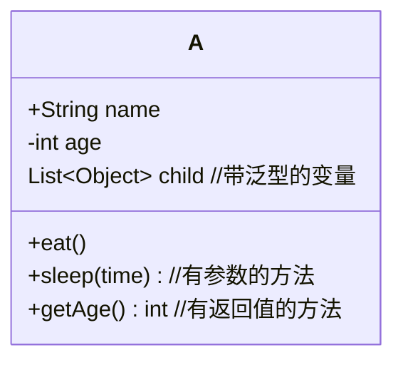

## 装饰器模式
装饰器模式（Decorator Pattern）是一种**结构性模式**，它用于在不改变对象现有结构（方法数和方法签名都不变）的前提下向其新增功能。

### 典型应用
Mybatis 中的 `org.apache.ibatis.executor.Executor` 是一个典型的案例。

设想一下，如果我们是 Mybatis 的开发者，我们设计了 `org.apache.ibatis.executor.Executor` 接口，并添加了不同的实现类，类图如下：
